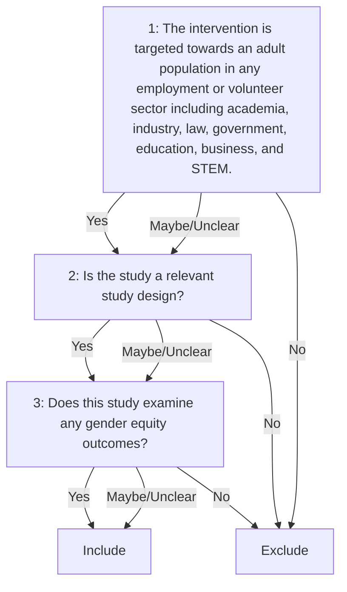

# Cheatsheet Parser
This project was generated with [GERPA 0.0.1](https://github.com/pvzhelnov/gerpa/releases/tag/v0.0.1) – Generator of Environments for Rapid Prototyping of Agents.

Open [experiment.ipynb](experiment.ipynb) to start prototyping.

## Q&A

**Q: What is a cheat sheet?**

**A:** A **screening cheat sheet** is a handy tool for [evidence synthesis](https://chatgpt.com/?q=What+is+evidence+synthesis?) teams. It documents the decision-making process clearly _before_ the eligibility assessment is started. This approach can be applied translated to **classification tasks** in other fields.

**Q: What does the parser do?**

**A:** The parser takes a PDF document containing a human-readable screening cheat sheet as **input**, passes it to a large language model (LLM), produces **structured output**, and dumps into a plain-text document ([YAML](https://en.wikipedia.org/wiki/YAML)).

**Q: Where can I get a cheat sheet template?**

**A:** Free cheat sheet samples are available as Word documents from Appendices 7 & 8 to the following article: [BMC Med. 2024;22:149. doi: 10.1186/s12916-024-03346-7](https://doi.org/10.1186/s12916-024-03346-7). Appendices are distributed via [FigShare](https://figshare.com/articles/journal_contribution/Additional_file_1_of_Interventions_on_gender_equity_in_the_workplace_a_scoping_review/25556501), MD5 checksum: `50092e26fc71af3cd2403e51f05cfa2e`. These cheat sheets are redistributed in [examples](examples/) under an open access license.

**Q: What are cheat sheet flow diagrams?**

**A:** A cheat sheet flow diagram helps to describe visually how the screening decisions are made.

When no flow diagram is found in the input PDF, the parser defaults to: Exclude if No to that question, else proceed to the next question; Include when there are no questions left. 

Unfortunately, the current [examples](examples/) do not contain a flow diagram. However, it can be as simple as this – copy and paste the following code to [Mermaid Live Editor](https://mermaid.live/) to save the diagram as an image, vector graphics, or PDF:

