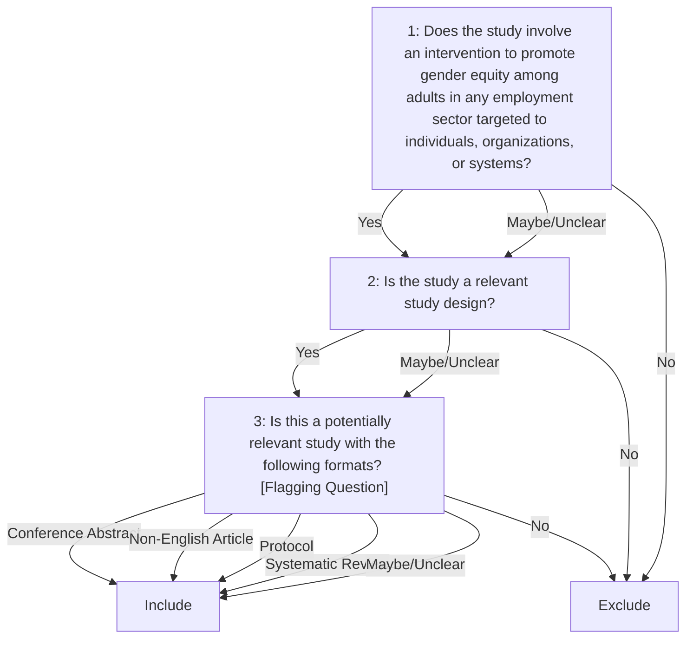

Copy and paste the following code to [Mermaid Live Editor](https://mermaid.live/) to save the diagram as an image, vector graphics, or PDF:

```mermaid
flowchart TD
  Q1[1: Does the study involve an intervention to promote gender equity among adults in any employment sector targeted to individuals, organizations, or systems?]
  Q2[2: Is the study a relevant study design?]
  Q3["3: Is this a potentially relevant study with the following formats? [Flagging Question]"]
  Exclude
  Include

  Q1 -->|Yes| Q2
  Q1 -->|Maybe/Unclear| Q2
  Q1 -->|No| Exclude

  Q2 -->|Yes| Q3
  Q2 -->|Maybe/Unclear| Q3
  Q2 -->|No| Exclude

  Q3 -->|Conference Abstract| Include
  Q3 -->|Non-English Article| Include
  Q3 -->|Protocol| Include
  Q3 -->|Systematic Review| Include
  Q3 -->|Maybe/Unclear| Include
  Q3 -->|No| Exclude
```
